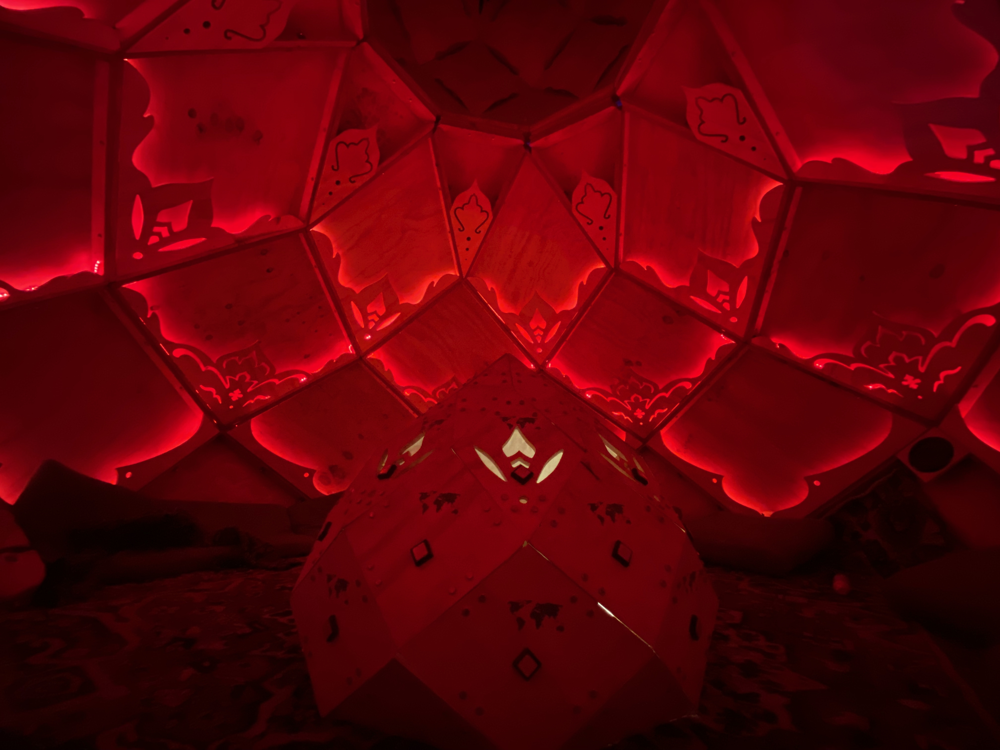

# Loss in Translation - Interior Lighting System

This repository contains the code that powers the interior lighting for the "Loss in Translation" Burning Man 2023 Honorarium art installation. The system creates synchronized lighting effects across multiple LED strips throughout the interior of the piece.

## Project Images

### The Installation

_Loss in Translation daytime_

_Interior lighting_

_Interior dome_

# Synced LED Strips

This uses the ESP NOW library to synchronize LED strips. The algorithm is as follows: Every N seconds, a microcontroller sends out its current time, mod 100 seconds. Whenever a module hears of this broadcasted message, it sets its time to the average of what it received and its own local time. It immediately broadcasts its new averaged time if the two times were too far apart. This allows the modules to quickly synchronize their times.

# Hardware

All that's required is one ESP8266 module (NodeMCU v1.0 or WeMOS D1 Mini were tested), a USB power bank, a WS2812B LED strip, and some connectors. You'll need two or more sets of these to have them communicate.

There are a few special pieces to note about this hardware setup:

- The logic is sent on pin D5. D5 happens to be connect to pin 14 of the ESP8266 on both the NodeMCU v1.0 and the WeMos D1 Mini, so they can both run the same program
- You'll need to solder the 5V line of the LED strip before the USB fuse, so that your battery bank can supply enough current
- The logic pin is between 0 and 3.3V. The LED strip expects 0 and 5V logic, but since 3.3V is high enough, it works out!

# Programming steps

- Install platformio
- Connect one of the microcontrollers via USB
- Run `platformio run -t upload` (This automatically installs FastLED).
